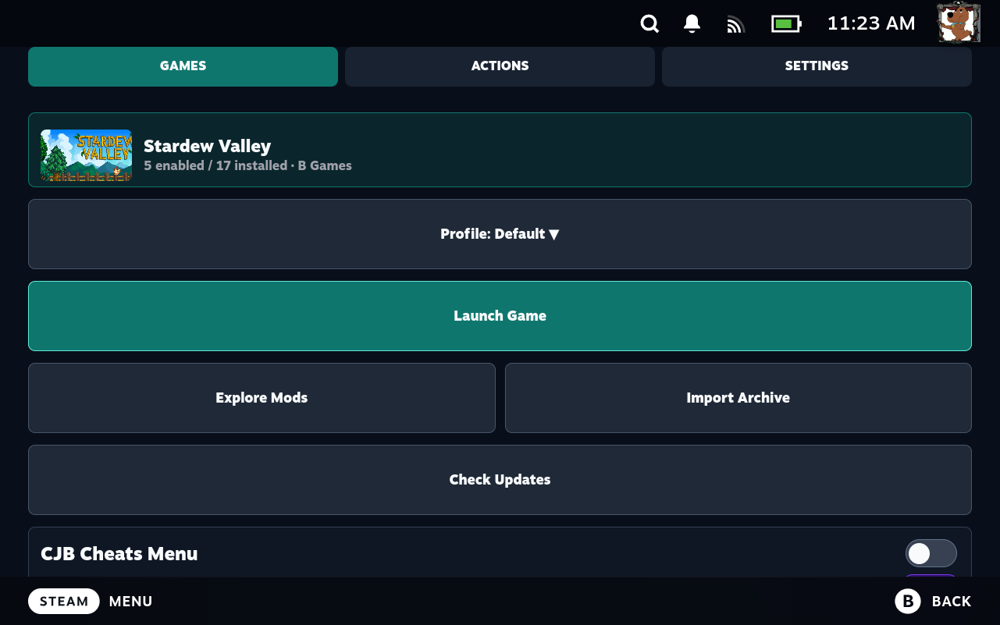
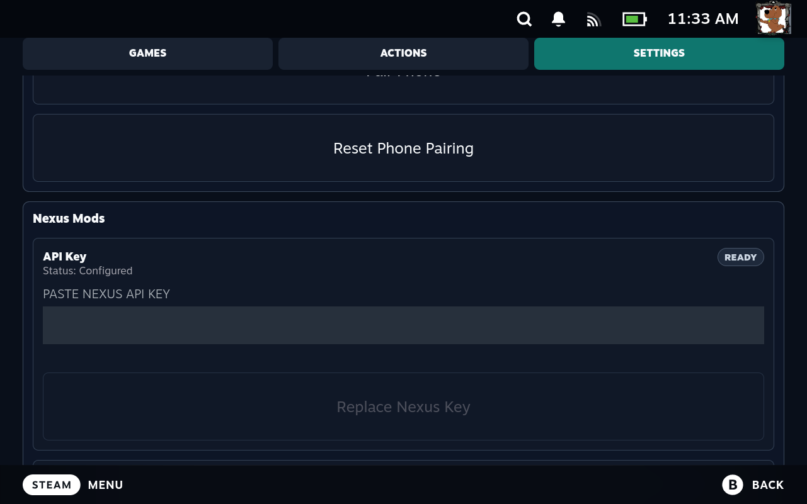
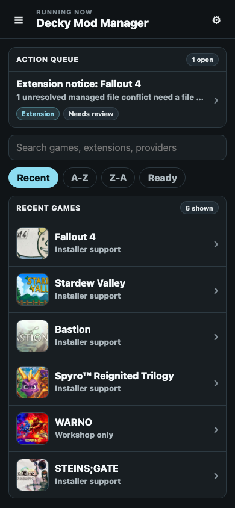
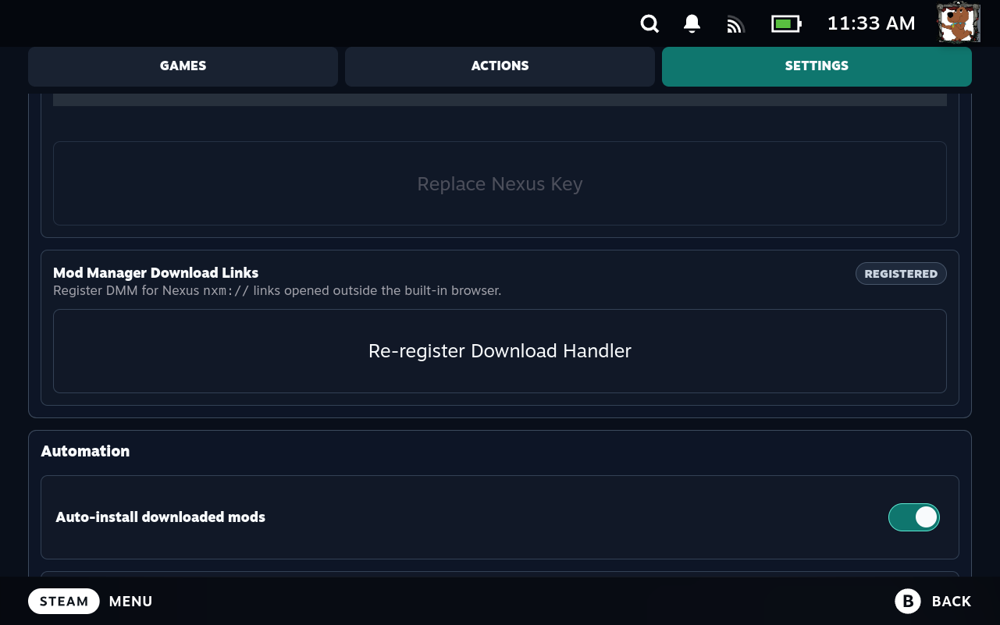

# Decky Mod Manager

**A Steam Deck-first mod manager built for Gaming Mode, with a private phone and tablet control surface.**

[](https://github.com/justyntemme/dmm/releases/latest)
[](https://github.com/justyntemme/dmm/actions/workflows/package.yml)
[](LICENSE)
[](go.mod)

Decky Mod Manager (DMM) runs a small Go service directly on the Steam Deck. Use the Decky interface for quick, controller-friendly work in Gaming Mode, or scan a QR code to open the more detailed management interface on a phone or tablet.

DMM is currently a developer preview. Stardew Valley with native Linux SMAPI has been validated end to end on Steam Deck; broader game support is supplied by first-party extensions modeled from verified Vortex extension behavior.

## Interfaces

| Steam Deck | Phone and tablet |
| --- | --- |
| Controller-first access to games, profiles, mod toggles, Nexus browsing, installer choices, launch actions, pairing, and device settings. | A power-user workspace for Action Center, profiles, priorities, conflicts, installer choices, activity, updates, diagnostics, and rollback. |

<p align="center">
  
</p>
<p align="center"><sub>Manage a profile, launch the game, explore sources, import archives, and toggle installed mods without leaving Gaming Mode.</sub></p>

<table>
  <tr>
    <td width="68%"></td>
    <td width="32%"></td>
  </tr>
  <tr>
    <td align="center"><sub>Device setup and automation stay on the Deck.</sub></td>
    <td align="center"><sub>The paired phone UI provides the larger power-user workspace.</sub></td>
  </tr>
</table>

These screenshots were captured from the live Steam Deck and phone interfaces during development.

## The Workflow

1. Open DMM from Decky and choose a supported game.
2. Select **Explore Mods** to browse Nexus from Gaming Mode, or import a supported archive/provider URL from the selected game.
3. On Nexus, click **Mod Manager Download**. DMM captures the short-lived `nxm://` credential and caches the archive immediately.
4. Complete any FOMOD or component choices in the Decky modal or phone Action Center.
5. Install into a profile, then enable or disable the mod. DMM reconciles that profile into the game directory.
6. Launch the game from its DMM page or from Steam.

Auto-install is enabled by default so captured archives do not sit idle. Auto-enable is disabled by default: a newly installed mod remains off until the user enables it. Both behaviors are configurable from Decky Settings.

## Why DMM

- **Built for Steam Deck.** The Go backend stays lightweight, and common work remains usable with a controller in Gaming Mode.
- **Phone optional.** Download, install, choose installer options, switch profiles, and toggle mods from Decky; use the phone UI when a larger advanced workspace is useful.
- **Profile-first management.** Mods are installed once into DMM-owned storage, then shared across profiles with independent enabled state, priority, and conflict choices.
- **Vortex-style deployment.** Staging, manifests, links, verification, repair, purge, and rollback keep managed state explicit and auditable.
- **Extension-owned game behavior.** Game-specific installers, roots, launch tools, load order, generated files, and runtime checks live in first-party Go extensions rather than generic core branches.
- **Source-aware installs.** Every mod retains its source identity for filtering, update checks, diagnostics, and display.
- **Live state.** WebSocket events update downloads, jobs, choices, deployments, and notifications without manual page refreshes.

## Features

### Mod Management

- Per-game profiles with create, seed, select, copy, move, and profile-scoped removal workflows.
- Enable/disable toggles that reconcile the active profile automatically.
- Mod priority, explicit file-conflict winners, plugin activation, and extension-provided load order.
- Reinstall from cache, source-aware update checks, managed-file verification, and recovery actions.
- FOMOD and multi-component installer choices that persist if the UI closes or the Deck loses power.
- ZIP, 7z, and RAR extraction in process with archive and path safety limits.

### Deployment Safety

- DMM-owned download cache, normalized staging area, SQLite state, and deployment manifests.
- Hardlink, symlink, or copy deployment selected by extension/runtime constraints.
- Preflight conflict detection before unmanaged files are touched.
- Transactional apply behavior with restore records and rollback points.
- Repair and purge operate only on files DMM can prove it owns.
- Existing Vortex, NMM, or manual state is treated conservatively instead of being silently adopted or removed.

See [vfs.md](vfs.md) for the complete storage, profile, deployment, conflict, and rollback model.

### Sources

| Source | Current path |
| --- | --- |
| Nexus Mods | Game browsing plus browser-generated `nxm://` capture and immediate caching |
| Thunderstore | Provider URL resolution and archive import |
| GitHub Releases | Release asset resolution and archive import |
| Modrinth | Project/version resolution and archive import |
| GameBanana | Download resolution and archive import |
| mod.io | Credential-gated provider import |
| CurseForge | Credential-gated provider import |
| Direct URL / local file | Game-scoped archive import |
| Steam Workshop | Installed-content visibility and extension-approved management through Steam APIs |

Steam Workshop is Steam-owned content. DMM does not stage Workshop files or provide a Workshop storefront; supported games can expose enable, disable, order, and unsubscribe actions through the Decky/Steam capability boundary.

## Installation

### Requirements

- A Steam Deck running [Decky Loader](https://github.com/SteamDeckHomebrew/decky-loader).
- A Nexus Mods account and API key for Nexus metadata.
- A phone/tablet on the same local network only if you want the advanced web interface.

### Developer Preview

1. Download `decky-mod-manager.zip` and `SHA256SUMS` from the [latest release](https://github.com/justyntemme/dmm/releases/latest).
2. Verify the archive against `SHA256SUMS`.
3. Install the ZIP through Decky Loader's developer plugin installation flow.
4. Open Decky Mod Manager. The backend starts with the plugin.
5. Sign in to Nexus Mods, generate a personal key from [API Access](https://www.nexusmods.com/users/myaccount?tab=api%20access), then open **Settings > Nexus Mods** in DMM.
6. Paste the key into **API Key**, select **Save Nexus Key**, and confirm the status changes to **Ready**.
7. In the same section, select **Register Download Handler** and confirm it changes to **Registered**. This makes DMM the current user's handler for Nexus `nxm://` and `nxm-protocol://` links, replacing a stale Vortex/NMM association if one exists.
8. Optional: select **Pair Phone** under **Settings > Security**, then scan the QR code to authorize a phone or tablet.

<p align="center">
  
</p>

### Verify Nexus Capture

1. Open a supported game in DMM and select **Explore Mods**.
2. Open a Nexus mod file page and select **Mod Manager Download**.
3. DMM should show a download notification and cache the archive immediately. Any required installer choices appear in Decky or the phone Action Center.

The built-in DMM browser captures Nexus links directly. Registration is still part of first-run setup so links opened from Firefox or another desktop application reach the same backend. DMM does not assume an older build, Vortex, or another manager already registered the protocol.

DMM has not been submitted to the Decky Plugin Store yet. The repository also includes an SSH-oriented test installer for contributors; it is not the normal end-user installation path. See [testing/README.md](testing/README.md) for that workflow.

## Security Model

- The phone API uses a generated bearer token delivered through the pairing QR code.
- LAN-only filtering is enabled by default. It can be disabled explicitly for a trusted VPN such as Tailscale.
- REST credentials are accepted in headers, not query strings; WebSocket query tokens are limited to the upgrade boundary.
- Provider credentials and captured download tokens are redacted from product logs.
- Remote downloads apply redirect-aware network policy, including private-address blocking where appropriate.
- Archive extraction enforces file-count, size, compression-ratio, and destination-confinement limits.
- Core deployment validates every extension-produced source and target path before filesystem writes.

## Compatibility

DMM does not infer support from a folder name or one successful archive. Every managed game has an explicit extension that declares its stores, identifiers, installer matchers, target roots, runtime requirements, launch tools, deployment behavior, plugin activation, load order, and lifecycle hooks.

The release gate compares DMM's extension inventory against a pinned Vortex source snapshot and runs the corresponding runtime contract tests. This establishes source-backed extension/API parity; it is not a claim that every community mod for every game has been manually tested on Steam Deck.

- [Extension framework](docs/extensionFramework.md)
- [Vortex extension inventory](docs/extensions/vortex-extension-inventory.md)
- [Vortex API gap analysis](docs/extensions/vortex-extension-api-gap-analysis.md)
- [Installed-device extension targets](extensionTargets.md)

## Architecture

```text
Decky UI (React)             Phone/tablet UI (Svelte)
        |                              |
        +---------- REST + WebSocket --+
                       |
                 Go backend
          +------------+-------------+
          |            |             |
      Providers    Game extensions   Jobs/events
          |            |             |
          +-------- Install planner --+
                       |
              SQLite + DMM storage
                       |
             Manifest-driven deploy
                       |
                 Steam game files
```

The backend owns provider resolution, downloads, archive inspection, installer planning, profile state, deployment, recovery, and persistence. Decky owns Steam-client-only capabilities such as launch options, game launch, native browser windows, notifications, and supported Workshop actions. UI code submits intent and renders state; it does not contain game-specific install rules.

## Development

### Prerequisites

- Go 1.26.2
- Node.js 20+
- npm
- Rust toolchain for the libloot helper

### Build and Test

```bash
make test
go vet ./...
make test-race
npm --prefix web ci
npm --prefix web run check
npm --prefix decky ci
npm --prefix decky run build
make package
```

Run the backend locally:

```bash
make build
./bin/dmm-server
```

The phone UI is then available at `http://127.0.0.1:17942`. Tagged pushes such as `v0.2.1` run the full release gate, build the Linux Decky package, smoke-test the packaged backend, publish ZIP/tar assets, and attach checksums.

For the test matrix, Steam Deck deployment scripts, live acceptance checks, and log commands, see [testing/README.md](testing/README.md).

## Logs and Data

```text
~/.local/state/decky-mod-manager/plugin.log
~/.local/state/decky-mod-manager/backend.log
~/.local/state/decky-mod-manager/nxm-handler.log
~/.local/share/decky-mod-manager/
```

Steam frontend and Decky injection errors are also available in:

```text
~/.local/share/Steam/logs/webhelper_js.txt
```

The Decky Settings debug area exposes redacted log tails, build identity, paths, diagnostics, and the release updater.

## License

Decky Mod Manager is licensed under [GPL-3.0-or-later](LICENSE).
